<div align="center">

# 🧠 AI Skill Gap Learning Platform

### **"Turn your resume into a roadmap."**

An intelligent, full-stack platform that analyzes your resume or skills against any job title, identifies your exact skill gaps using NLP, and generates a personalized AI-powered learning roadmap to close them.

[](https://your-live-demo-url.vercel.app)
[](https://nodejs.org)
[](https://reactjs.org)
[](https://python.org)
[](https://mongodb.com)
[](https://ai.google.dev)

</div>

---

## 🌐 Live Demo

> **[https://aiskillgap.netlify.app/](https://aiskillgap.netlify.app/)**

---

## 📌 Project Overview

| | |
|---|---|
| **Project Name** | AI Skill Gap Learning Platform |
| **Impact** | Eliminates guesswork from career transitions — tells you *exactly* what to learn and *where* to learn it. |
| **Description** | A three-tier web application where users upload their resume (PDF/DOCX) or paste raw text, select a target job role, and receive: (1) a list of skills they already have, (2) skills they are missing, and (3) a curated, AI-generated 5-step learning roadmap with free resources — all in seconds. |

---

## ✨ Key Features

| Feature | Description |
|---|---|
| 📄 **Resume Parsing** | Accepts PDF, DOCX, or plain text input |
| 🔍 **NLP Skill Extraction** | Uses spaCy PhraseMatcher to detect 30+ technical skills from resume content |
| 🤖 **Dynamic Job Analysis** | Gemini 2.5 Flash dynamically determines the top 10–15 skills required for *any* job title |
| 🗺️ **AI Roadmap Generation** | Produces a personalized, structured 5-step learning plan with free resource links |
| 📊 **Visual Dashboard** | D3.js-powered charts visualizing skill gap breakdown |
| 🔐 **JWT Authentication** | Secure user registration and login with token-based protected routes |
| 🛡️ **Protected Routes** | Frontend and backend both enforce authentication barriers |
| 📱 **Responsive UI** | Fully responsive design built with Tailwind CSS |
| ⚡ **Toast Notifications** | Real-time feedback using Sonner toast system |

---

## 🏗️ System Architecture

The application follows a **three-tier microservices-inspired architecture**:

```mermaid
graph TB
    subgraph CLIENT["🖥️ Client (React + Vite)"]
        UI["Pages: Login, Register,\nProfileInput, Dashboard"]
        CTX["AuthContext\n(JWT State)"]
        UI --> CTX
    end

    subgraph SERVER["⚙️ Server (Node.js + Express)"]
        AUTH_R["/api/auth\nregister | login"]
        SKILL_R["/api/skills/analyze\n(Protected)"]
        AUTH_MW["authMiddleware\n(JWT Verify)"]
        GEMINI["Google Gemini 2.5 Flash\n(Dynamic Skills + Roadmap)"]
        SKILL_R --> AUTH_MW --> GEMINI
    end

    subgraph AI["🤖 AI Microservice (Python + Flask)"]
        SPACY["spaCy NLP\n(Skill Extraction)"]
        PARSER["PyPDF2 / python-docx\n(File Parsing)"]
        PARSER --> SPACY
    end

    subgraph DB["🗄️ MongoDB Atlas"]
        USERS["Users Collection\n(name, email, hashed_password)"]
    end

    UI -->|"HTTP Requests\n(Axios)"| AUTH_R
    UI -->|"multipart/JSON"| SKILL_R
    SKILL_R -->|"Base64 file\nor text JSON"| SPACY
    AUTH_R -->|"Mongoose ODM"| USERS
    GEMINI -->|"Structured JSON\nResponse"| SKILL_R
    SKILL_R -->|"Gap Report +\nRoadmap JSON"| UI
```



---

## 🔄 Application Flow Diagram


---

## 🔐 Auth / Login Flow


---

## 📊 Database Schema


> **Note:** The application is currently **stateless** for analysis results — skill gap reports are computed on-the-fly and returned to the client without being persisted, keeping the database lean.

---

## 🔁 Request Lifecycle

```mermaid
sequenceDiagram
    participant Client as React Client
    participant Express as Express Server
    participant Auth as authMiddleware
    participant Python as Flask AI Service
    participant Gemini as Google Gemini API

    Client->>Express: POST /api/skills/analyze<br/>(Authorization: Bearer JWT)
    Express->>Auth: Verify JWT Token
    Auth->>Auth: jwt.verify(token, JWT_SECRET)
    Auth->>Express: req.user = { _id, name, email }

    Express->>Python: POST /extract_skills<br/>{ fileBuffer | resumeText, targetRole }
    Python->>Python: base64 decode → PyPDF2/python-docx parse
    Python->>Python: spaCy PhraseMatcher → extract skills
    Python-->>Express: { skills: ["React", "Git", ...] }

    Express->>Gemini: Dynamic skills for targetJobTitle
    Gemini-->>Express: { requiredSkills: ["TypeScript", "Docker", ...] }

    Express->>Express: calculateMissingSkills(required, userSkills)
    Express->>Gemini: Generate 5-step roadmap for missingSkills
    Gemini-->>Express: { summary, steps[{skill,goal,resourceURL}], conclusion }

    Express-->>Client: Full JSON response:<br/>{ requiredSkills, userSkills, missingSkills, learningRoadmap }
    Client->>Client: Render Dashboard with D3 Chart + Roadmap Cards
```



---

## 🛠️ Tech Stack

### Frontend — `Client/`
| Technology | Version | Purpose |
|---|---|---|
| **React** | 19 | UI Component Framework |
| **Vite** | 7 | Build Tool & Dev Server |
| **React Router DOM** | 7 | Client-side Routing |
| **Tailwind CSS** | 3 | Utility-First Styling |
| **D3.js** | 7 | Data Visualization Charts |
| **Axios** | 1 | HTTP Client |
| **Sonner** | 2 | Toast Notification System |
| **Lucide React** | latest | Icon Library |

### Backend — `Server/`
| Technology | Version | Purpose |
|---|---|---|
| **Node.js** | 18+ | JavaScript Runtime |
| **Express** | 5 | Web Framework |
| **Mongoose** | 8 | MongoDB ODM |
| **JSON Web Token** | 9 | Authentication Tokens |
| **bcryptjs** | 3 | Password Hashing |
| **@google/genai** | 1 | Google Gemini AI SDK |
| **Axios** | 1 | HTTP calls to AI Microservice |
| **express-async-handler** | 1 | Async Error Wrapper |
| **dotenv** | 17 | Environment Variables |

### AI Microservice — `AI_service/`
| Technology | Version | Purpose |
|---|---|---|
| **Python** | 3.10+ | Runtime |
| **Flask** | latest | Micro Web Framework |
| **Flask-RESTful** | latest | REST API Resource Structure |
| **Flask-CORS** | latest | Cross-Origin Support |
| **spaCy** | latest | NLP Skill Extraction |
| **en_core_web_sm** | — | spaCy English Language Model |
| **PyPDF2** | latest | PDF Text Extraction |
| **python-docx** | latest | DOCX Text Extraction |

### Infrastructure
| Service | Role |
|---|---|
| **MongoDB Atlas** | Cloud NoSQL Database |
| **Google Gemini 2.5 Flash** | AI-powered skill and roadmap generation |
| **Vercel / Netlify** | Frontend hosting |
| **Railway / Render** | Backend & AI service hosting |

---

## 📁 Folder Structure

```
AI_Inovation/
│
├── 📁 Client/                    # React + Vite Frontend
│   ├── public/
│   ├── src/
│   │   ├── assets/               # Static images and media
│   │   ├── components/           # Reusable UI components
│   │   ├── context/
│   │   │   └── AuthContext.jsx   # JWT auth state (React Context)
│   │   ├── lib/                  # Utility / helper functions
│   │   ├── pages/
│   │   │   ├── LoginPage.jsx     # User login UI
│   │   │   ├── RegisterPage.jsx  # User registration UI
│   │   │   ├── ProfileInput.jsx  # Resume / text input + job title
│   │   │   ├── DashboardPage.jsx # Skill gap results + roadmap
│   │   │   ├── Home.jsx          # Landing page
│   │   │   └── NotFoundPage.jsx  # 404 fallback
│   │   ├── utils/                # Axios instance / API helpers
│   │   ├── App.jsx               # Router with protected routes
│   │   └── main.jsx              # React entry point
│   ├── index.html
│   ├── vite.config.js
│   └── tailwind.config.js
│
├── 📁 Server/                    # Node.js + Express Backend
│   ├── config/
│   │   └── db.js                 # MongoDB connection via Mongoose
│   ├── controllers/
│   │   ├── auth.js               # registerUser, loginUser
│   │   └── skillController.js    # analyzeUserText (main orchestrator)
│   ├── middleware/
│   │   ├── authMiddleware.js     # JWT protect middleware
│   │   └── errorMiddleware.js    # Global error handler
│   ├── models/
│   │   └── User.js               # Mongoose User schema
│   ├── routes/
│   │   ├── authRoutes.js         # POST /api/auth/register|login
│   │   └── skillRoutes.js        # POST /api/skills/analyze (protected)
│   ├── server.js                 # Express app entry point
│   └── .env                      # Environment variables (gitignored)
│
├── 📁 AI_service/                # Python + Flask Microservice
│   ├── app.py                    # Flask app with /extract_skills endpoint
│   ├── requirements.txt          # Python dependencies
│   └── venv/                     # Python virtual environment
│
├── package.json                  # Root-level scripts
└── README.md
```

---

## ⚙️ Installation & Setup

### Prerequisites
- Node.js `v18+`
- Python `3.10+`
- MongoDB Atlas account (free tier works)
- Google AI Studio API key (for Gemini)

---

### 1. Clone the Repository
```bash
git clone https://github.com/your-username/AI_Inovation.git
cd AI_Inovation
```

---

### 2. Backend Setup (`Server/`)
```bash
cd Server
npm install
```

Create `Server/.env`:
```env
PORT=5000
MONGO_URI=mongodb+srv://<user>:<password>@cluster0.mongodb.net/skillbridge
JWT_SECRET=your_super_secret_jwt_key_here
GOOGLE_API_KEY=your_google_gemini_api_key
PYTHON_SERVICE_URL=http://localhost:5001
```

Start the server:
```bash
npm run server   # Development (nodemon)
# or
npm start        # Production
```

---

### 3. AI Microservice Setup (`AI_service/`)
```bash
cd AI_service
python -m venv venv

# Windows
venv\Scripts\activate
# Linux/Mac
source venv/bin/activate

pip install -r requirements.txt
python -m spacy download en_core_web_sm
```

Start the Flask service:
```bash
python app.py
# Runs on http://localhost:5001
```

---

### 4. Frontend Setup (`Client/`)
```bash
cd Client
npm install
```

Create `Client/.env`:
```env
VITE_API_URL=http://localhost:5000
```

Start the dev server:
```bash
npm run dev
# Runs on http://localhost:5173
```

---

### 5. All Services Running

| Service | Port | Command |
|---|---|---|
| React Frontend | `5173` | `npm run dev` in `Client/` |
| Express Backend | `5000` | `npm run server` in `Server/` |
| Flask AI Service | `5001` | `python app.py` in `AI_service/` |

---

## 🔒 Security Practices

| Practice | Implementation |
|---|---|
| **Password Hashing** | `bcryptjs` with salt rounds of 10 — passwords are never stored in plaintext |
| **JWT Authentication** | Tokens signed with `JWT_SECRET`, expire in **30 days** |
| **Protected API Routes** | `authMiddleware` verifies every request to `/api/skills/*` before processing |
| **Protected Frontend Routes** | `ProtectedRoute` component in React redirects unauthenticated users to `/login` |
| **Environment Variables** | All secrets in `.env` files — **never committed to Git** (`.gitignore` enforced) |
| **Request Size Limiting** | Express configured with `5mb` body limit to prevent payload attacks |
| **CORS** | Enabled at both Express and Flask levels with appropriate headers |
| **Error Masking** | Global `errorHandler` middleware returns sanitized error messages — no stack traces to client |
| **Input Validation** | Auth controller checks for missing/duplicate fields before any DB operation |

---

## 📡 API Documentation

### Base URL
```
http://localhost:5000/api
```

---

### 🔐 Auth Routes — `/api/auth`

#### `POST /api/auth/register`
Register a new user.

**Request Body:**
```json
{
  "name": "Arjun Sharma",
  "email": "arjun@example.com",
  "password": "securepassword123"
}
```

**Success Response `201`:**
```json
{
  "_id": "64abc123...",
  "name": "Arjun Sharma",
  "email": "arjun@example.com",
  "token": "eyJhbGciOiJIUzI1NiIsInR5cCI6IkpXVCJ9..."
}
```

**Error Responses:**
| Status | Message |
|---|---|
| `400` | `User already exists` |
| `400` | `Invalid user data` |

---

#### `POST /api/auth/login`
Authenticate an existing user.

**Request Body:**
```json
{
  "email": "arjun@example.com",
  "password": "securepassword123"
}
```

**Success Response `200`:**
```json
{
  "_id": "64abc123...",
  "name": "Arjun Sharma",
  "email": "arjun@example.com",
  "token": "eyJhbGciOiJIUzI1NiIsInR5cCI6IkpXVCJ9..."
}
```

**Error Responses:**
| Status | Message |
|---|---|
| `401` | `Invalid email or password` |

---

### 🤖 Skill Routes — `/api/skills` *(Protected)*

All routes require the header:
```
Authorization: Bearer <JWT_TOKEN>
```

---

#### `POST /api/skills/analyze`
Analyze resume content and return a full skill gap report and learning roadmap.

**Request Body (Text Input):**
```json
{
  "resumeText": "Experienced developer with React, Node.js, MongoDB, and Git skills...",
  "targetJobTitle": "Full Stack Developer"
}
```

**Request Body (File Input):**
```json
{
  "fileBuffer": "<base64_encoded_file_content>",
  "filename": "resume.pdf",
  "targetJobTitle": "Data Scientist"
}
```

**Success Response `200`:**
```json
{
  "message": "Full dynamic skill analysis and roadmap generated successfully.",
  "targetRole": "Data Scientist",
  "requiredSkills": ["Python", "Pandas", "NumPy", "SQL", "Scikit-learn", "Tableau", "Statistics"],
  "userSkills": ["Python", "SQL"],
  "missingSkills": ["Pandas", "NumPy", "Scikit-learn", "Tableau", "Statistics"],
  "learningRoadmap": {
    "summary": "You have a strong Python foundation...",
    "steps": [
      {
        "skill": "Pandas",
        "goal": "Master data manipulation and analysis",
        "resourceTitle": "Pandas Official Docs — 10 Minutes to Pandas",
        "resourceURL": "https://pandas.pydata.org/docs/user_guide/10min.html"
      }
    ],
    "conclusion": "With consistent effort over 3-4 months, you'll be ready!"
  },
  "userId": "64abc123..."
}
```

**Error Responses:**
| Status | Message |
|---|---|
| `400` | `Target job title is missing` |
| `400` | `Request body is empty or missing required fields` |
| `401` | `Not authorized, token failed` |
| `500` | `AI skill extraction service is currently unavailable` |

---

### 🐍 AI Microservice — `http://localhost:5001`

#### `POST /extract_skills`
Internal endpoint called by Express. Not intended for public use.

**Request Body:**
```json
{
  "resumeText": "Raw text content OR",
  "fileBuffer": "<base64>",
  "filename": "resume.pdf",
  "targetRole": "Full Stack Developer"
}
```

**Success Response `200`:**
```json
{
  "skills": ["React", "Node", "MongoDB", "Git"],
  "raw_text_length": 2048,
  "targetRole": "Full Stack Developer"
}
```

---

## ⚡ Performance & Optimizations

| Area | Optimization |
|---|---|
| **File Transfer** | Files are encoded as Base64 in JSON between Express and Flask — eliminates multipart boundary parsing overhead |
| **NLP Speed** | spaCy `PhraseMatcher` (not full NER) used for skill extraction — O(n) linear complexity, significantly faster than regex |
| **AI API Efficiency** | Gemini `gemini-2.5-flash` selected for its speed/cost balance over Pro models |
| **Structured AI Output** | `responseSchema` enforced in Gemini API calls — returns valid JSON directly, skipping post-processing |
| **Body Size Limit** | Express body parser capped at `5mb` to prevent large payload abuse |
| **Async Error Handling** | `express-async-handler` wraps controllers — avoids repetitive try/catch boilerplate |
| **Fallback Logic** | If Gemini skill-fetch fails, falls back to a hardcoded MERN skill list — prevents total failure |
| **Model Loading** | spaCy model loaded once at startup, cached in memory — avoids reloading on every request |
| **Frontend Build** | Vite + React — significantly faster HMR and smaller bundle than CRA |

---

## 🚀 Deployment

### Frontend — Vercel (Recommended)
1. Push `Client/` to GitHub
2. Import into [vercel.com](https://vercel.com)
3. Set root directory to `Client`
4. Add environment variable: `VITE_API_URL=https://your-backend.railway.app`
5. Deploy ✅

### Backend (Express) — Railway
1. Push `Server/` to GitHub
2. Create a new project on [railway.app](https://railway.app)
3. Add all environment variables from `.env`
4. Set start command: `node server.js`
5. Deploy ✅

### AI Microservice (Flask) — Render
1. Push `AI_service/` to GitHub
2. Create a new **Web Service** on [render.com](https://render.com)
3. Set build command: `pip install -r requirements.txt && python -m spacy download en_core_web_sm`
4. Set start command: `python app.py`
5. Update `PYTHON_SERVICE_URL` in Railway to point to Render URL ✅

> **Important:** Set `debug=False` in `app.py` and ensure `HOST=0.0.0.0` for all cloud deployments.

---

## 👨‍💻 Author

<div align="center">

### Arjun

**Full Stack Developer & AI Enthusiast**

[](https://github.com/Arjun20X)
[](https://linkedin.com/in/your-profile)

*Built with ❤️ using the MERN stack + Python AI microservices*

</div>

---

<div align="center">

**⭐ If this project helped you, consider starring the repo!**

</div>
